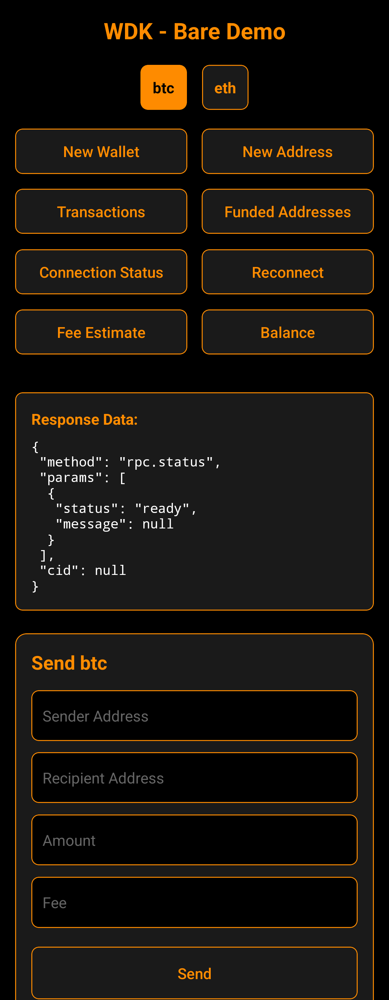

# WDK Bare Expo Demo

A example app showcasing the integration of the Wallet Development Kit (WDK) in a React Native Expo application using [react-native-bare-kit](https://github.com/holepunchto/react-native-bare-kit) and [lib-wallet-bare](https://github.com/tetherto/lib-wallet-bare).

## Features

This demo app demonstrates key WDK capabilities:

- Wallet creation and management
- Multi-currency support (BTC and ETH)
- Balance checking
- Address generation
- Transaction history
- Fee estimation
- Connection status monitoring
- Send/receive functionality

<div align="center">
  
</div>

## Getting Started

Start by installing the dependencies:

```sh
npm install
```

When finished, you can run the app on either iOS or Android.

### iOS

```sh
npm run ios
```

### Android

> [!IMPORTANT]
> You may experience problems running the app on an emulated Android device under QEMU due to https://github.com/holepunchto/libjs/issues/4. If you encounter crashes, try running the app on a real Android device instead.

```sh
npm run android
```

## Architecture

The app demonstrates:

- Integration with WDK through lib-wallet-bare
- IPC communication setup using Worklet
- Proper state management for wallet operations
- Real-time response handling
- Error management

## Project Structure

```
wdk-bare-expo/
├── app/                 # Application source code
├── assets/             # Images and assets
├── ios.bundle.cjs      # iOS bundle for WDK
├── android.bundle.cjs  # Android bundle for WDK
└── package.json        # Project dependencies
```

## License

Apache-2.0
